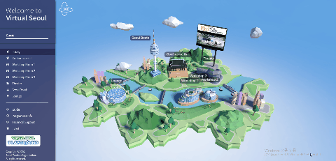

# 국제협회연합 & 서울관광재단 3D 온라인 컨퍼런스

## Table of Content

- [Role & Responsibility](#Role--Responsibility)
- [Work Flow](#Application-Work-Flow)
- [Demo](#Demo)
- [Project Description](#Project-Description)
- [Main Features](#Main-features)
- [Achievement](#Achievement)
- [Note](#Note)

# Role & Responsibility

저의 업무는 프런트 엔드와 백 엔드 개발하는 것이었습니다. 애자일 방법론을 기반으로 짧은 개발 주기를 반복해 이해관계자와 최종 사용자의 요구사항을 빠르게 했으며 그 결과 만족도 높는 소프트웨어를 생산할 수 있었습니다. 그 밖에도 어플리케이션 테스트 및 배포, 디버깅 그리고 유지 및 관리를 하였습니다. 이러한 과정에서 기획자, 디자이너 그리고 개발자들과의 협업 방식을 배울 수 있었으며 그 배움을 토대로 프로젝트를 성공적으로 이끌어 갈 수 있었습니다.

### 본 프로젝트에서의 저의 업무 내용입니다:

- Front-end 시스템 디자인 
- Expressjs RESTful API 구현
- 리액트 컴포넌트 생성 (tables, banners, poppers, Modals, buttons 등)
- User Authentication
- 라이브 스트리밍, 비디오 스트리밍 스케줄링
- SMS, 푸시 알림 기능 구현
- 브라우저 호환 (Chrome, Safari, Firefox, MS Edge, IE11)
- 반응형 디자인 (모바일 기기, 테블릿 지원)
- 앱 내 유저 액티비티 통계 산출
- Gitlab Administration
- 유저 가이드 & FAQ 영문본 작성
- 외국인 유저 기술 지원 & 상담

[Jira](https://www.atlassian.com/software/jira)에서 저에게 할당된 이슈의 수입니다. 

#### 총 325개의 이슈 중에서 146개를 완료했습니다.

# Application Work Flow

#### 이 앱은 Reactjs, Redux, Expressjs MysqlDB, Babylonjs 그리고 AWS를 사용해 만들어졌습니다.

# Demo

### News

#### 이 플랫폼은 아리랑뉴스를 통해 전세계에 소개되었습니다. 

[Link to the news](https://www.youtube.com/watch?v=ksBnRT1f2Ak&t=2s)

### Website URL

#### [Link to the website](https://wclf2021.miceworld.or.kr/)
참고 - 현재는 행사기간이 아닌 관계로 대부분의 기능에 대한 접근이 차단되었습니다.

### 데모 영상

- [Seoul Map](https://www.youtube.com/watch?v=6EdqKznxncA)
- [LIVE Streaming demo](https://www.youtube.com/watch?v=a9wX4MSkSyg)
- [Video Chat](https://www.youtube.com/watch?v=edzgNn5f5yQ)

# Project Description

이 플랫폼은 [국제협회연합(UIA)](https://uia.org/) 그리고 [서울관광재단(STO)](http://www.sto.or.kr/english/index)의 온라인 컨퍼런스 행사를 위해 만들어졌습니다.

- 개발 기간: 2020.06 ~ 2020.09
- 유지보수 기간: 2020.09 ~ 2021.04
- 행사기간 하루 평균 접속자 수: 3,000 ~ 5,000
- 접속 국가: 26개의 국가
- 브라우저: Chrome, IE, Firefox, Safari, Edge

## Main features

### Video chat

### Stamp Event

### 3D Virtual Seoul tour

### Live And VOD Streaming

### Seoul Membership Card Event

### 본 플랫폼을 통해 유저는 실제 행사장에 있는 듯한 현장감을 느낄 수 있습니다.

# Achievement

### 10개 이상의 추가적인 계약을 성사 시켰습니다.

참여했던 온라인 컨퍼런스 행사의 리스트입니다. 
- [IOHA2021 국제 온라인 학술대회 & 전시회](https://ioha2021conference.org/)
- [유네스코 국제 3D 온라인 컨퍼런스](https://iclc2021.govent.io/)
- [한국병원협회 온라인 컨퍼런스 & 전시회](https://khc2020.salin.co.kr) 
- [지멘스 온라인 컨퍼런스 & 전시회](https://siemens-evavconference.govent.io) 
- Asia TEFL 국제 온라인 컨퍼런스
- 인천국제공항공사 온라인 컨퍼런스

### 2. 프로젝트에서 동기를 받아 리액트 오픈소스를 제작하였습니다.

#### [Crontab library](https://www.npmjs.com/package/reactjs-crontab)

많은 애플리케이션에서 Crontab (Job Scheduling) 기능을 필요로 한다는 것을 알게 되었고 오픈소스 형태로 제작해 NPM 커뮤니티에 기여하였습니다.

### 3. 재사용 가능한 컴포넌트와 API를 만들었습니다.

#### 참조 - [Code Sandbox](https://codesandbox.io/s/radio-3mtce?file=/src/App.jsx)에 제작된 재사용 가능한 라디오 버튼입니다. 

# Note
회사의 규정 상 본 프로젝트의 소스코드를 제공할 수 없습니다. 양해 부탁드립니다.
